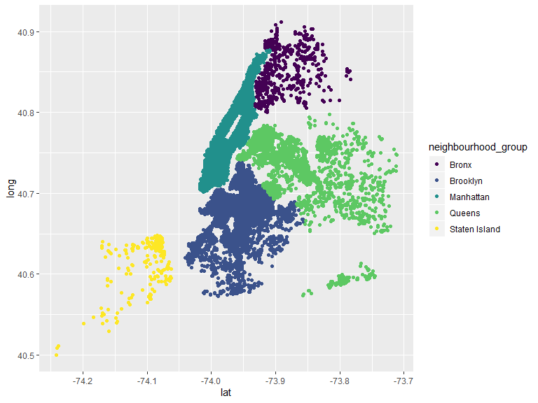
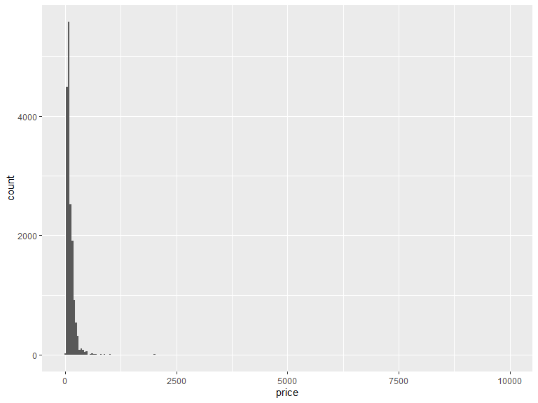
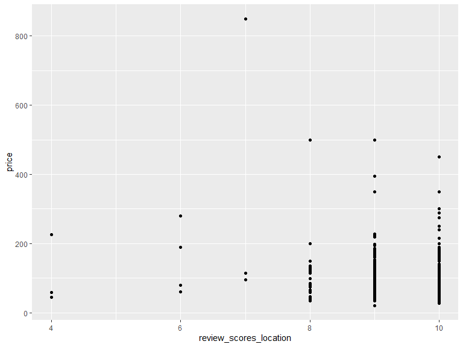
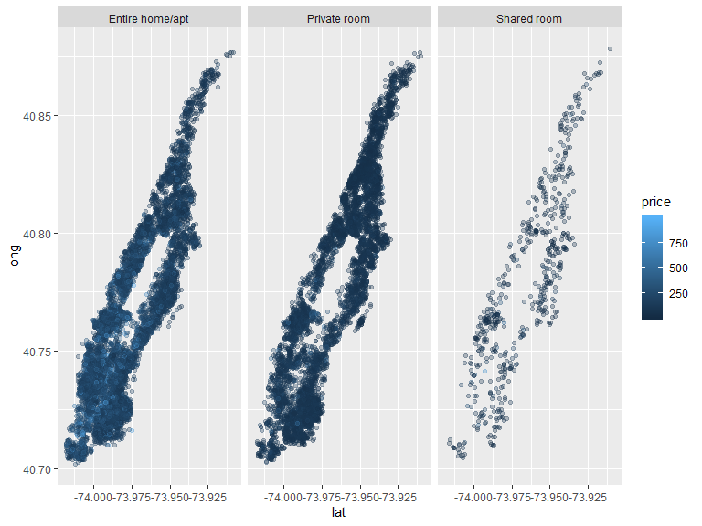

20191008-case\_study
================
Jared Garfinkel
10/8/2019

``` r
data(nyc_airbnb)
str(nyc_airbnb)
```

    ## Classes 'spec_tbl_df', 'tbl_df', 'tbl' and 'data.frame': 40753 obs. of  17 variables:
    ##  $ id                            : num  7949480 16042478 1886820 6627449 5557381 ...
    ##  $ review_scores_location        : num  10 NA NA 10 10 10 10 9 10 9 ...
    ##  $ name                          : chr  "City Island Sanctuary relaxing BR & Bath w Parking" "WATERFRONT STUDIO APARTMENT" "Quaint City Island Community." "Large 1 BDRM in Great location" ...
    ##  $ host_id                       : num  119445 9117975 9815788 13886510 28811542 ...
    ##  $ host_name                     : chr  "Linda & Didier" "Collins" "Steve" "Arlene" ...
    ##  $ neighbourhood_group           : chr  "Bronx" "Bronx" "Bronx" "Bronx" ...
    ##  $ neighbourhood                 : chr  "City Island" "City Island" "City Island" "City Island" ...
    ##  $ lat                           : num  -73.8 -73.8 -73.8 -73.8 -73.8 ...
    ##  $ long                          : num  40.9 40.9 40.8 40.8 40.9 ...
    ##  $ room_type                     : chr  "Private room" "Private room" "Entire home/apt" "Entire home/apt" ...
    ##  $ price                         : num  99 200 300 125 69 125 85 39 95 125 ...
    ##  $ minimum_nights                : num  1 7 7 3 3 2 1 2 3 2 ...
    ##  $ number_of_reviews             : num  25 0 0 12 86 41 74 114 5 206 ...
    ##  $ last_review                   : Date, format: "2017-04-23" NA ...
    ##  $ reviews_per_month             : num  1.59 NA NA 0.54 3.63 2.48 5.43 2.06 5 2.98 ...
    ##  $ calculated_host_listings_count: num  1 1 1 1 1 1 1 4 3 4 ...
    ##  $ availability_365              : num  170 180 365 335 352 129 306 306 144 106 ...

  - how are airbnb prices related to rent in the neighborhood?

  - which neighborhood has the most expensive and which the least?

  - do hosts with multiple sites have higher prices or ratings?

  - does price have any relation to ratings?

  - Is average lenth of stay related to neighborhood? price? etc?

<!-- end list -->

``` r
nyc_airbnb %>% 
  ggplot(aes(x = lat, y = long, color = neighbourhood_group)) +
  geom_point()
```



``` r
nyc_airbnb %>% 
  filter(neighbourhood_group == "Brooklyn") %>% 
  ggplot(aes(x = price)) +
  geom_histogram(bins = 250)
```



``` r
nyc_airbnb %>% 
  group_by(neighbourhood_group, room_type) %>% 
  summarize(med_price = median(price, na.rm = TRUE)) %>% 
  pivot_wider(
    names_from = room_type,
    values_from = med_price
  )
```

    ## # A tibble: 5 x 4
    ## # Groups:   neighbourhood_group [5]
    ##   neighbourhood_group `Entire home/apt` `Private room` `Shared room`
    ##   <chr>                           <dbl>          <dbl>         <dbl>
    ## 1 Bronx                            100              55            43
    ## 2 Brooklyn                         145              65            40
    ## 3 Manhattan                        190              90            65
    ## 4 Queens                           119              60            39
    ## 5 Staten Island                    112.             55            25

``` r
nyc_airbnb %>% 
  filter(neighbourhood_group == "Staten Island", room_type == "Shared room")
```

    ## # A tibble: 1 x 17
    ##       id review_scores_l~ name  host_id host_name neighbourhood_g~
    ##    <dbl>            <dbl> <chr>   <dbl> <chr>     <chr>           
    ## 1 1.61e7                9 Comf~  1.05e8 Nikki     Staten Island   
    ## # ... with 11 more variables: neighbourhood <chr>, lat <dbl>, long <dbl>,
    ## #   room_type <chr>, price <dbl>, minimum_nights <dbl>,
    ## #   number_of_reviews <dbl>, last_review <date>, reviews_per_month <dbl>,
    ## #   calculated_host_listings_count <dbl>, availability_365 <dbl>

``` r
nyc_airbnb %>% 
  count(neighbourhood_group, room_type) %>% 
  pivot_wider(
    names_from = room_type,
    values_from = n
  )
```

    ## # A tibble: 5 x 4
    ##   neighbourhood_group `Entire home/apt` `Private room` `Shared room`
    ##   <chr>                           <int>          <int>         <int>
    ## 1 Bronx                             192            429            28
    ## 2 Brooklyn                         7427           9000           383
    ## 3 Manhattan                       10814           7812           586
    ## 4 Queens                           1388           2241           192
    ## 5 Staten Island                     116            144             1

``` r
nyc_airbnb %>% 
  group_by(neighbourhood_group) %>% 
  summarize(
    mean_price = mean(price, na.rm = TRUE),
    mean_review = mean(review_scores_location, na.rm = TRUE)) %>% 
  ggplot(aes(x = mean_review, y = mean_price)) +
  geom_point() +
  facet_grid(~neighbourhood_group)
```

``` r
nyc_airbnb %>% 
  count(neighbourhood)
```

    ## # A tibble: 217 x 2
    ##    neighbourhood                  n
    ##    <chr>                      <int>
    ##  1 Allerton                      23
    ##  2 Arden Heights                  6
    ##  3 Arrochar                      14
    ##  4 Arverne                       71
    ##  5 Astoria                      755
    ##  6 Bath Beach                    11
    ##  7 Battery Park City             65
    ##  8 Bay Ridge                     91
    ##  9 Bay Terrace                    5
    ## 10 Bay Terrace, Staten Island     1
    ## # ... with 207 more rows

``` r
nyc_airbnb %>% 
  filter(neighbourhood == "Astoria") %>% 
  ggplot(aes(x = review_scores_location, y = price)) +
  geom_point()
```



``` r
nyc_airbnb %>% 
  filter(neighbourhood_group == "Manhattan",
         price < 1000) %>% 
  ggplot(aes(x = lat, y = long, color = price)) +
  geom_point(alpha = .3) +
  facet_grid(~room_type)
```



``` r
nyc_airbnb %>% 
  filter(
    borough == "Manhattan",
    price > 2000)
  leaflet() %>% 
  addTiles() %>% 
    addMarkers(~long, ~lat)
```
